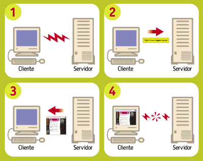

===============================================================
Capítulo 6: Perca o medo do servidor Apache e do protocolo CGI
===============================================================

É hora de colocar em prática os nossos conhecimentos de funções e módulos para criar nosso primeiro programa para a Internet: o Calendário Dinâmico. Uma vez instalado em um servidor web, ele exibirá o calendário do mês atual com o dia de hoje assinalado. Ao final desse capítulo você terá construído seus primeiros programas CGI em linguagem Python. Mas para chegar lá, é preciso entender o funcionamento de um CGI, e conhecer como se dá a operação básica de um servidor HTTP.
Quem é quem do HTTP

A Web é construída a partir de duas tecnologias fundamentais: a linguagem HTML e o protocolo HTTP. HTML, ou Hypertext Markup Language é a codificação usada para criar as páginas da Web. Este não é o assunto deste curso, mas vamos usar um pouco de HTML nos exemplos desse capítulo.

O segundo pilar da Web é o HTTP, ou Hypertext Transport Protocol - protocolo de transporte de hipertexto. Esse é o conjunto de comandos e regras que define como deve ser a comunicação entre um browser (como o Internet Explorer ou o Mozilla) e um servidor HTTP (como o Apache ou o Interner Information Server). A expressão "servidor HTTP" pode significar duas coisas: o software que serve páginas via HTTP, ou o computador onde esse software está instalado. No mundo Unix, softwares servidores são chamados de "daemons", e a sigla HTTPd descreve um "HTTP daemon" genérico. Essa é a sigla que vamos usar para diferenciar o software do hardware.

A relação entre um browser e um HTTPd é descrita pelos computólogos como "cliente-servidor". Isso significa que a interação entre esses dois softwares sempre parte do browser, que é o cliente. O servidor não tem nenhuma iniciativa, limitando-se a responder aos comandos enviados pelo cliente.

Quando você digita uma URL como http://ramalho.pro.br/aprendaprog/index.html, o seu browser localiza e conecta-se ao servidor ramalho.pro.br e envia-lhe o comando ``GET /aprendaprog/index.html``. O servidor então lê o arquivo index.html da pasta aprendaprog, transmite seu conteúdo para o cliente e encerra a conexão. Esses são os passos básicos de qualquer interação de um browser com um HTTPd: conexão, solicitação, resposta e desconexão.

Páginas dinâmicas
==================

No exemplo que acabamos de ver, ``index.html`` é o que chamamos de uma página estática. A resposta do servidor consiste apenas em enviar uma cópia do documento para o cliente. Sites que incluem transações (como lojas virtuais), interatividade (como chats), ou atualizações muito freqüentes (como este) utilizam páginas dinâmicas. Neste caso, ao receber a URL http://www.magnet.com.br/ index_html, nosso servidor HTTPd Apache passa a solicitação para o aplicativo Zope, instalado no servidor. O Zope monta imediatamente a página ``index_html`` listando as notícias mais recentes de nosso banco de dados, a hora atual e outros elementos. A página recém montada então é passada para o Apache, que finalmente a transmite para o seu navegador.

O Zope é apenas uma das tecnologias de páginas dinâmicas que existem hoje. O ASP da Microsoft, o !ColdFusion da Macromedia e o software livre PHP são outros sistemas dinâmicos de montagem de páginas. Mas o mecanismo mais antigo, e também o mais simples de entender e de configurar, é o velho e bom CGI - ou Common Gateway Interface, um protocolo básico para interação entre um HTTPd e um programa gerador de páginas dinâmicas. É com ele que nos vamos trabalhar a partir de agora.

Configurando o seu HTTPd
=========================

Para desenvolver aplicativos CGI é importante ter um bom ambiente de testes. O ideal é ter acesso a um HTTPd só para você na fase de desenvolvimento, para maior agilidade na depuração, e não correr o risco de comprometer o funcionamento de um servidor público com bugs nos seus CGIs em construção.

Pode ser que o seu micro já possua um servidor HTTP. A Microsoft inclui o Personal Web Server ou o IIS em diferentes versões do Windows. Você pode tentar usar um desses HTTPd para fazer os exemplos, mas sugerimos fortemente que você vá até o http://www.apache.org baixe o Apache, que não custa nada (é open source), roda em qualquer plataforma Win32 ou Unix, é fácil de instalar e é tão robusto e versátil que é o HTTPd mais usado em todo mundo, alem de ser o favorito disparado entre os melhores e maiores sites da Web. Vale a pena conhecê-lo, e o download tem apenas 3 MB.

No Windows, o Apache vem com um instalador bem amigável. Nossa única recomendação é instalar diretamente em um diretório como c:\apache e não no famoso c:\Arquivos de Programas. Isso porque os espaços em nomes de diretórios às vezes causam problemas na execução de programas originários do Unix como Python e o próprio Apache.

Uma vez terminada a instalação, você deve rodar o servidor, acionando o programa "Start Apache" que foi instalado em Iniciar > Programas > Apache Web Server. Isso faz abrir uma janela DOS com uma mensagem como "Apache/1.3.9 (Win32) running...". Não feche esta janela, pois isso encerrará a execução do servidor. Agora você pode ver se está tudo certo digitando essa URL mágica em seu browser: http://127.0.0.1/. Se a instalação foi bem sucedida, você verá uma página com o texto: "It Worked! The Apache Web Server is Installed on this Web Site!" (Funcionou! O servidor Apache está instalado neste Web Site!). (Figura 1).

.. image:: _static/img_06_02.gif

Vale a pena saber que o endereço 127.0.0.1 tem um significado especial. Os criadores da Internet reservaram esse número IP para o "loopback", ou seja, testes de conexão de uma máquina com ela mesma. Em outras palavras, o endereço 127.0.0.1 sempre se refere à maquina onde você está, que é conhecida também pelo nome "localhost". Se o seu micro estiver bem configurado, a URL http://localhost/ deve ter o mesmo efeito. Caso contrário, utilize o número IP e vamos em frente.

Seu primeiro CGI
=================

Chegamos ao grande momento. Seguindo a tradição milenar, vamos começar fazendo um CGI em Python que produz uma página com as palavras "Olá, Mundo!". O programa completo você vê na listagem abaixo::

  #!/python/python

  print 'Content-type: text/html'
  print
  print '<HTML><BODY>'
  print '<H1>Olá, Mundo!</H1>'
  print '</BODY></HTML>'

Antes de digitar este exemplo, é bom destacar dois aspectos essenciais. Primeiramente, o comentário da linha 1 é importante. O CGI não vai funcionar sem ele. Ao executar um script CGI, o Apache procura na primeira linha um comentário especial marcado pelos caracteres '#!'. Os sinais '#!' devem estar encostados na margem esquerda da página, e o restante dessa linha deve conter o caminho até o programa executável do interpretador que rodará o script. Note que o caminho pode ser especificado usando a barra '/' do Unix, em vez da contra-barra '\' preferida pelo Windows.

Em meu computador, o Python está instalado em uma pasta chamada "python" localizada no mesmo drive onde está o Apache (D:, no meu caso). Se o seu Python está instalado em outro lugar, você precisará alterar a linha 1. Em caso de dificuldades, nossa sugestão é que você desinstale o interpretador e o reinstale em uma pasta "python" diretamente na raiz do mesmo disco onde você acabou de instalar o Apache.

Outro detalhe importante são os print das linhas 3 e 4. Sua função não é meramente decorativa. O comando print 'Content-type: text/html' produz a parte obrigatória do cabeçalho da página, exigida pelo protocolo CGI. Este cabeçalho define o tipo do documento a ser transmitido de acordo com um esquema de classificação chamado "MIME". O "text/html" é o "MIME type" padrão de documentos HTML. Um texto ASCII puro teria o MIME type "text/plain" e um arquivo de foto JPEG seria "image/jpeg". O print da linha 4 gera uma linha em branco, que marca o fim do cabeçalho. Se uma dessas duas linhas não for digitada corretamente, o CGI não funcionará.

O restante da listagem apenas produz o código HTML de uma página muito simples. Os comandos marcados pelos sinais < e > são os chamados tags, ou marcações, da linguagem HTML. A marcação <H1>Manchete</H1>, por exemplo, define que uma manchete de nível 1, que será exibida pelo navegador como um texto em letras grandes.

Instalar e testar o CGI
========================

O programinha de exemplo da seção anterior deverá ser salvo com o nome ``ola.py`` no diretório ``cgi-bin`` dentro da pasta do Apache. Este diretório é criado automaticamente pelo instalador do Apache no Windows, mas deve estar vazio inicialmente. Coloque o ``ola.py`` ali dentro e faça o grande teste: digite http:// 127.0.0.1/cgi-bin/ola.py em seu browser. Das duas, uma: ou você viu a página "Olá, Mundo!" e está feliz com seu primeiro CGI, ou ficou deprimido por encontrar uma mensagem de "Internal Server Error". Neste caso, saiba que você está em boa companhia: todo programador de CGI já se deparou com esta mensagem. Os que dizem que nunca a viram estão mentindo. Mesmo que seu script tenha funcionado, é proveitoso entender as causas de um "Internal Server Error" para saber como depurá-lo.

O "Internal Server Error" ocorre quando o script CGI não gera um cabeçalho mínimo, formado por uma linha de Content-type e uma linha em branco. É o que o nosso ola.py deveria fazer nas linhas 3 e 4. Vejamos passo a passo como diagnosticar a causa do problema.

(a) Verifique se o script pode ser executado a partir do prompt do DOS
-----------------------------------------------------------------------

Abra uma janela do DOS e digite::

  X:\> c: (ou d:)

O passo acima não é necessário se você já está no disco certo::

  X:\> cd \apache\cgi-bin
  X:\> python ola.py

Neste momento, três coisas podem acontecer:

   1. O script funciona perfeitamente, exibindo o cabeçalho, uma linha em branco, e o HTML da página - pule para o passo (b).
   2. O DOS responde "Comando ou nome de arquivo inválido" - leia o passo (c).
   3. O interpretador Python exibe um traceback e uma mensagem de erro qualquer - vá até o passo (d).

(b) Se o script funciona a partir do prompt mas não através do Apache
----------------------------------------------------------------------

Neste caso, existem quatro causas possíveis:

1. O comentário da linha 1 está incorreto. Lembre-se que é ele que informa ao Apache qual interpretador invocar para rodar o script. Se o seu interpretador Python (python.exe) foi instalado na pasta d:\python, então a linha 1 do seu script deve ser assim: #!d:\python\python.exe (Na verdade, a extensão .exe é dispensável, e se o Apache e o Python estão no mesmo disco, você pode usar a notação mais elegante do Unix e escrever apenas #!/python/python)

2. O script não foi colocado na pasta cgi-bin. Se o seu Apache foi instalado em c:\apache, o programa ola.py tem que estar exatamente neste local: c:\apache\cgi-bin\ola.py. Se este foi o problema, corrija e volte ao passo (a).

3. Apache pode não estar configurado para executar programas na pasta cgi-bin. Isso não deve acontecer em uma instalação nova do Apache, mas se você está usando um HTTPd que foi instalado por outra pessoa, ela pode ter mudado esta configuração. Neste caso, peça ajuda ao responsável pela instalação.

4. No Linux, ou em qualquer Unix, o Apache deverá ter permissão de executar o script ola.py. Para tanto, você pode precisar usar o comando chmod para setar o bit de execução de ola.py. Em Linux, o comando abaixo deve dar conta do recado:

::

  $ chmod a+x ola.py

Se você usa outro Unix, experimente::

  $ chmod 755 ola.py

Uma vez marcado como executável o script poderá ser invocado diretamente pelo nome, sem necessidade de mencionar o interpretador, assim::

  $ ./ola.py

Se este teste funcionou, tente acionar o script novamente pelo browser, porque um shell do Unix também utiliza o comentário #! da linha 1 para localizar o interpretador. Se isto não deu certo, volte ao item 2a acima. Se o teste funcionou mas o programa exibe um traceback, vá até o passo (d).

.. todo:: Revisar todas as referências cruzadas tipo "vá até o passo x"

(c) Confira a instalação do Python
-----------------------------------

Verifique se o interpretador Python (arquivo python.exe no DOS) está instalado corretamente e em local acessível. Se ele foi instalado em uma pasta chamada c:\python, o seguinte comando deve acionar o seu CGI::

  X:\> c:\python\python ola.py

O que fazer então:

1. se agora o script funcionou perfeitamente, exibindo o cabeçalho, uma linha em branco, e o HTML da página, pule para o passo (b).

2. se você continua vendo "Comando ou nome de arquivo inválido" ou outra mensagem do sistema operacional, verifique novamente o local exato da instalação do seu Python e se necessário, reinstale. Feito isso, volte para o passo (a).

(d) Confira o seu programa
---------------------------

Se ao rodar o script a partir do prompt você está vendo um traceback do interpretador Python, o problema está mesmo dentro do seu programa. Quando ocorre um erro de sintaxe (``SyntaxError``) o interpretador apenas leu, mas não chegou a executar nenhuma linha do seu script. Assim, o famoso cabeçalho "Content-type: ..." e a linha em branco não são enviados para o servidor, e o traceback que o ajudaria a detectar o problema não chega ao seu browser, mas vai para um arquivo onde o Apache registra mensagens de erro. Este arquivo chama-se error.log e fica em /apache/logs/. Você pode inspecioná-lo com qualquer editor de texto. Outras vezes, o erro pode acontecer durante a execução e após o envio do cabeçalho. Neste caso, o traceback é perdido para sempre. É por isso que programadores de CGI experientes procuram testar exaustivamente seus scripts a partir da linha de comando antes de tentar acioná-lo pelo browser. Há tambem aguns truques que podem ser usados durante a depuração de um CGI para que as mensagens de erro sejam transmitidas para o browser. Em seguida veremos como.

Afinal, um CGI dinâmico
========================

Nosso primeiro exemplo de CGI foi bolado para ser simples, mas é também um tanto tolo. Não gera nenhuma informação variável; o mesmo efeito poderia ser obtido com uma página estática. A página dinâmica mais simples que conseguimos imaginar é uma que mostre a hora certa (de acordo com o relógio do servidor). Para fazer um CGI assim, é bom conhecermos duas funções do módulo time. Vamos ver o que elas fazem acionando o interpretador Python. Primeiro, temos que importar as duas funções de dentro do módulo::

  >>> from time import time, localtime

Podemos invocar diretamente a função time()::

  >>> time()
  953500536.8

Que número é esse? Como explicamos no final do capítulo passado, o Python, assim como muitos programas originários da plataforma Unix, marca o tempo contando o número de segundos desde 1 de janeiro de 1970. Isto quer dizer que haviam se passado 953 milhões, 500 mil e 536 segundos e 8 décimos desde 1/1/1970 quando eu digitei time() no IDLE do meu computador. Isto é muito interessante, mas como transformar segundos transcorridos na hora atual? É para isso que serve a função localtime()::

  >>> t = time()
  >>> localtime(t)
  (2000, 3, 19, 18, 33, 19, 6, 79, 0)
  >>>

Agora nós associamos os segundos transcorridos à variável t, e em seguida usamos a função localtime para transformar os segundos em uma seqüência de 9 números que fornecem os seguintes dados::

  localtime(t)[0:3] # 2000, 3, 19 (ano, mês e dia)
  localtime(t)[3:6] # 18, 33, 19 (hora, minutos e segundos)
  localtime(t)[6]   # 6 (dia da semana; 0 = segunda-feira; 6 = domingo)
  localtime(t)[7]   # 79 (número do dia no ano; de 1 a 366 em anos bissextos)
  localtime(t)[8]   # 0 (indicador de horário de verão; 0 = não; 1 = sim)

Esta função se chama localtime porque além de converter de segundos transcorridos para data e hora, ela o faz levando em conta o fuso horário configurado no sistema operacional, fornecendo portanto a hora local. Para saber a hora no meridiano de Greenwich, ou UTC no jargão moderno, usaríamos a função gmtime()::

  >>> from time import gmtime
  >>> gmtime(t)
  (2000, 3, 19, 21, 33, 19, 6, 79, 0)
  >>>

Agora vamos combinar as novas funções para montar um CGI, hora.py, que mostre a hora local do servidor::

  # hora.py - CGI que exibe a hora local do servidor

  from time import time, localtime

  print 'Content-type: text/html'
  print

  h, m, s = localtime(time())[3:6]
  print '<HTML><BODY>'
  print '<H1>Hora: %02d:%02d:%02d</H1>' % (h, m, s)
  print '
* de acordo com o relógio interno deste servidor
'
  print '</BODY></HTML>'

Uma vez salvo no diretório cgi-bin, este script poderá ser acessado pela URL http:// 127.0.0.1/cgi-bin/hora.py. A página gerada conterá a hora, minutos e segundos do instante em que ela foi invocada. Qual o defeito do nosso relógio em CGI? Experimente e você verá.

Um relógio que se atualiza
===========================

É um pouco frustrante acessar uma página que mostra a hora certa, com precisão de segundos, mas fica parada no tempo (Figura 2). Para atualizar os segundos, você tem que acionar o comando de "reload" do seu browser (Exibir ¡ Atualizar ou [F5] no Internet Explorer; View ¡ Reload ou [Control][R] no Navigator). Nossa página parece um relógio quebrado, que só mostra a hora certa quanto chacoalhado.

.. image:: _static/img_06_03.gif

O ideal seria que o servidor atualizasse a página que está no seu browser a cada segundo. Infelizmente, isso é impossível. Como já dissemos, o protocolo HTTP é do tipo cliente-servidor, e isto quer dizer que a iniciativa de toda interação fica do lado do cliente. Não há como o servidor por conta própria enviar uma nova página sem que ela seja antes solicitada pelo navegador. Esta é uma limitação importante do protocolo HTTP que você precisa ter em mente ao bolar seus programas CGI.

Os browsers modernos suportam uma uma solução parcial para este problema. Eles reconhecem um cabeçalho especial chamado Refresh, cuja presença em um documento serve para instruir o browser a solicitar novamente a página após algum tempo. O argumento do Refresh é um número de segundos que o navegador deve esperar para pedir a atualização. Logo veremos como isso funciona na prática.

Para usar o Refresh basta acrescentar uma linha ao cabeçalho da resposta gerado pelo nosso CGI hora.py. A nova versão, ``hora2.py`` ficará assim::

  #!/python/python
  # hora2.py - CGI que exibe continuamente hora local do servidor

  from time import time, localtime

  print 'Content-type: text/html'
  print 'Refresh: 0.6'
  print

  h, m, s = localtime(time())[3:6]
  print '<HTML><BODY>'
  print '<H1>Hora: %02d:%02d:%02d</H1>' % (h, m, s)
  print '
* de acordo com o relógio interno deste servidor
'
  print '</BODY></HTML>'

A única novidade é a linha 7, onde acrescentamos "Refresh: 0.6" ao cabeçalho. Em vez de mandar o browser atualizar a página a cada 1 segundo, após alguns testes decidimos fazê-lo a cada 6 décimos de segundo. Fizemos assim porque quanto experimentamos com "Refresh: 1" a contagem freqüentemente pulava um segundo, por exemplo de 10:30:20 direto para 10:30:22. Isso não quer dizer que o relógio adiantava, porque a cada nova solicitação a hora certa estava sendo consultada pelo nosso CGI; mas como o tempo de espera somado ao tempo de solicitação e resposta era maior que 1 segundo, a exibição da hora sofria alguns sobressaltos.

Fazendo o refresh a cada 6 décimos, muitas vezes estamos atualizando a página duas vezes no mesmo segundo, o que é um desperdício de processamento. Mas pelo menos nos livramos da enervante perturbação na contagem. É claro que se o servidor estiver sobrecarregado, ele pode levar mais de um segundo para responder. Nesse caso, de nada adiantará se o browser fizer novas solicitações a cada 0.6 segundo.

Calendário Dinâmico
=====================

Agora vamos juntar o que já sabemos sobre CGI com o módulo calendar que vimos no capítulo anterior para fazer um protótipo rápido do nosso Calendário Dinâmico. As passagens mais interessantes da listagem abaixo são comentados a seguir::

  #!/python/python
  # calendin.py - calendário dinâmico - protótipo 1

  print 'Content-type: text/html\n'

  try:
      from time import time, localtime
      from calendar import monthcalendar
      from string import join

      ano, mes = localtime(time())[:2]

      print '<HTML><TITLE>Calendário Dinâmico</TITLE>'
      print '<BODY>'

      print '<H1>Calendário do mês %02d/%04d</H1>' % (mes, ano)
      print '<PRE>'
      for semana in monthcalendar(ano, mes):
          print join( map(str, semana),'\t' )
      print '</PRE>'

  except:
      import sys
      sys.stderr = sys.stdout
      from traceback import print_exc
      print '
<H3>Erro no CGI:</H3><PRE>'
      print_exc()
      print '</PRE>'

  print '</BODY></HTML>'

O que fizemos, linha a linha:

Linha 4
  Logo de saída produzimos o cabeçalho mínimo necessário. A linha em branco, em vez de ser gerada por um segundo comando print, está incluída no final própria string do cabeçalho (o '\n' representa uma quebra de linha, e o próprio print produz outra quebra; assim obtemos a linha em branco para encerrar o cabeçalho).

Linha 6
  Para facilitar a depuração, colocamos praticamente o CGI inteiro dentro de um bloco try/except. Qualquer falha na execução deste bloco será tratada a partir da linha 23. Com isso, esse script só deverá gerar um "Internal Server Error" se houver um erro de sintaxe, justamente o tipo de falha mais fácil de localizar rodando o script a partir de uma linha de comando. Desta forma a depuração fica bem mais simples.

Linhas 7 a 9
  Importamos várias funções, todas velhas conhecidas.

Linha 11
  Extraímos o ano e o mês do resultado de localtime(time()).

Linha 13
  Iniciamos a produção do HTML, agora colocando um título na página (que aparecerá na barra de título da janela do browser).

Linhas 17 a 20
  Para simplificar a formatação do calendário, colocamos seu conteúdo entre um par de tags <PRE></PRE>. O tag <PRE> faz com que o browser respeite as quebras de linha até o tag </PRE>. Normalmente, o navegador ignora tabulações e quebras de linha, tratando tudo como simples espaços, mas isso estragaria nosso calendário, pois queremos mostrar uma semana por linha. O código das linhas 18 e 19 foi roubado sem alterações da listagem 3 do capítulo anterior.

Linha 22
  Abrimos um bloco except para tratar qualquer erro que tenha ocorrido até aqui. Abrir um bloco except sem qualificar o tipo de exceção que será tratado é normalmente uma má idéia, porque pode mascarar muitos bugs. Nesse caso, o except "pega-tudo" está justificado porque em seguida exibiremos o traceback completo, revelando qualquer bug que tentar se esconder.

Linhas 23 e 24
  Importamos o módulo sys, para podermos manipular os objetos stdout e stderr. Esses são os chamados "dispositivos lógicos" para onde toda a saída de dados do Python é direcionada. Mensagens geradas pelo comando print são enviadas para stdout, que normalmente está associado à tela do computador ou terminal. Durante a execução de um CGI, o stdout é redirecionado para o HTTPd, que vai enviar para o cliente tudo o que passar por este dispositivo. Mensagens de erro e tracebacks do Python, no entanto, vão para stderr. Se o script é invocado pela linha de comando, o stderr também está associado à tela, e assim podemos ver os tracebacks. Mas ao executar um CGI, o HTTPd simplesmente ignora o dispositivo stderr após o envio do cabeçalho, ocasionando a perda dos tracebacks. Na linha 24 associamos sys.stderr ao objeto sys.stdout. Desta maneira as mensagens de erro passam a ser enviadas para o browser através do HTTPd, como ocorre com os textos gerados por print.

Linha 25
  Importamos uma função do módulo traceback para uso na linha 27.

Linha 26
  Geramos tags para uma linha horizontal (
) e o título 'Erro no CGI:'; abrimos um tag <PRE> para manter a formatação original das linhas do traceback.

Linha 27
  Usamos a função print_exc() do módulo traceback para gerar o texto de uma descrição de erro.

Linha 30
  Encerramos o programa gerando os tags que marcam o fim de uma página HTML.

Protótipo melhorado
====================

Agora que colocamos o calendário básico para funcionar, está na hora de melhorar sua apresentação. Vamos deixar de lado o recurso preguiçoso do tag <PRE> e colocar os dias do mês dentro de uma tabela construída em HTML (Figura 3). Aproveitando outros recursos daquela linguagem, vamos também colorir os finais de semana e assinalar o dia de hoje. Você encontra o programa ``calendin2.py`` na listagem abaixo.

.. image:: _static/img_06_04.gif

::

  #!/python/python
  # calendin2.py - calendário dinâmico - protótipo 2

  print 'Content-type: text/html\n'

  try:
      from time import time, localtime
      from calendar import monthcalendar
      from string import join

      ano, mes, hoje = localtime(time())[:3]

      print '<HTML><TITLE>Calendário Dinâmico</TITLE>'
      print '<BODY>'
      print '
'
      print '<H1>Calendário de %02d/%04d</H1>' % (mes, ano)
      print '<TABLE>'
      print '<TR>'
      for dia_sem in ['seg','ter','qua','qui','sex','sab','dom']:
          if dia_sem in ['sab','dom']: bgcolor = 'green'
          else: bgcolor = 'blue'
          print '<TH WIDTH="45" BGCOLOR="%s">' % bgcolor
          print '<H3>%s</H3></TH>' % dia_sem
      print '</TR>'
      for semana in monthcalendar(ano, mes):
          print '<TR>'
          num_dia_sem = 0
          for dia in semana:
              if dia == hoje:
                  bgcolor = 'pink'
              elif num_dia_sem >= 5:
                  bgcolor = 'lightgreen'
              else:
                  bgcolor = 'lightblue'
              print '<TD ALIGN="RIGHT" BGCOLOR="%s">' % bgcolor
              if dia != 0:
                  print '<H2>%2d</H2>' % dia
              print '</TD>'
              num_dia_sem = num_dia_sem + 1
          print '</TR>'
      print '</TABLE>
'

  except:
      import sys
      from traceback import print_exc
      sys.stderr = sys.stdout
      print '
<H3>Erro no CGI:</H3><PRE>'
      print_exc()
      print '</PRE>'

  print '</BODY></HTML>'

Principais novidades em relação à versão anterior:

Linha 11
  Além do ano e do mês, guardamos o dia de hoje, para poder assinalá-lo no calendário.

Linha 15
  Vamos centralizar tudo na página.

Linha 17
  Abrimos o tag <TABLE> que conterá o calendário propriamente dito. Esta tabela só será fechada pelo tag </TABLE> na linha 41 do programa.

Linha 18
  Iniciamos a primeira linha da tabela (<TR> = Table Row ou linha da tabela).

Linha 19
  Vamos percorrer os nomes dos dias da semana para construir o cabeçalho da tabela.

Linhas 20 e 21
  Sábados e domingos terão fundos verdes (green); demais dias terão fundos azuis (blue).

Linha 22
  Tabelas em HTML são divididas em "células". Há dois tags para definir células, o <TH> (table head = cabeça) e o <TD> (table data = dados). Os dias da semana ficarão dentro de células TH com largura de 45 pixels e a cor de fundo definida acima. A largura dessas células determinará a largura das colunas.

Linha 23
  O nome de cada dia da semana é colocado entre tags <H3></H3>, para ênfase, e o tag </TH> é aplicado para fechar cada célula.

Linha 24
  Fechamos a primeira linha da tabela.

Linha 25
  Iniciamos um loop para percorrer cada semana do mês.

Linha 26
  Abrimos a linha da tabela correspondente a uma das semanas.

Linha 27
  Zeramos o contador que permitirá identificar sábados e domingos (a função monthcalendar retorna semanas com início às segundas-feiras; em nossa contagem, segunda-feira será o dia zero).

Linha 28
  Iniciamos outro loop, agora para percorrer cada dia da semana.

Linhas 29 a 34
  A cor do fundo da próxima célula é definida assim: a célula de hoje é rosa (pink); sábados e domingos (dias 5 e 6 na semana) serão verde-claro (light green) e os demais dias serão azul-claro (light blue)

Linha 35
  Abrimos a célula do dia, com a cor escolhida. Ela será fechada na linha 38.

Linhas 36 e 37
  Se o número do dia é diferente de zero, colocamos o conteúdo da célula. Lembre-se que a função monthcalendar completa com zeros as semanas do primeiro e último dia do mês.

Linha 39
  Incrementamos o contador de dia da semana. Aqui se encerra o bloco que percorre os dias.

Linha 40
  Fechamos a linha da tabela. Fim do loop que corresponde às semanas.

Próximas paradas
=================

Aqui termina nosso primeiro contato com programação aplicada à Web. Neste capítulo você instalou seu próprio servidor Apache, e implementou seus primeiros programas CGI. Os princípios que você está aprendendo aqui se aplicam a qualquer tecnologia de geração de páginas dinâmicas. Para construir os exemplos, lançamos mão de código HTML. Não é nosso objetivo aqui abordar esta outra linguagem, mas não podemos fazer coisas interessantes na Web sem conhecer um pouco dela. Vamos manter o uso de HTML em um nível bem elementar, e continuaremos explicando os tags mais importantes de cada exemplo, mas seu aproveitamento poderá ser melhor se você estudar por conta própria. O tutorial do Caique, que você encontra no site da [[http://www.magnet.com.br|Magnet]], é mais que suficiente para acompanhar o restante deste curso.

No próximo número, aperfeiçoaremos nosso calendário para torná-lo interativo: em vez de mostrar sempre o mês atual, vamos permitir que o usuário escolha um mês e um ano qualquer, e também navegue para frente e para trás de mês em mês. Isso nos levará a explorar o uso de URLs com argumentos e formulários em HTML. Até lá!

PS. A revista MAGNET deixou de ser publicada, então este tutorial não teve continuação...
